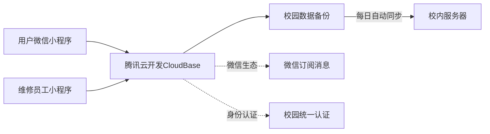

# 校园维修小程序可行性方案：单校园深度运营版

## 一、项目概览

**项目名称**：校易修 - 校园一站式维修服务平台  
**核心定位**：专注于单一高校的精细化维修服务，打造闭环运营模式  
**服务范围**：初期覆盖某大学校区（示例：华南理工大学五山校区，师生约3万人）  
**核心价值**：解决校园维修响应慢、流程不透明、质量难保证三大痛点  


## 二、精简技术架构方案

### 1. 基础架构（完全适配校园场景）



### 2. 具体技术选型

| 组件 | 选择 | 理由 | 月成本 |
|------|------|------|--------|
| 前端框架 | 微信小程序原生 | 校园用户覆盖率100% | 0元 |
| 后端服务 | 腾讯云开发(CloudBase) | 免运维，与小程序无缝集成 | 0-50元* |
| 数据库 | 云开发数据库 | 自动扩缩容，事务支持 | 含在基础套餐 |
| 文件存储 | 云开发存储 | 免费额度足够校园使用 | 0-20元* |
| 消息推送 | 微信订阅消息 | 用户打开率高 | 0元 |
| 校内备份 | 树莓派/旧电脑+Nginx | 满足校方数据要求 | 0元（利旧设备） |

> *注：校园项目月活跃<2000时基本在免费额度内，超出部分极低*

### 3. 关键技术创新点

- **校园定位围栏**：仅接受校园地理围栏内(±500m)的维修请求
- **离线模式支持**：维修工人在宿舍楼无信号区可离线接单，网络恢复后自动同步
- **极简数据同步**：每日00:00自动加密备份关键数据到校内服务器，满足校方数据安全要求
- **无感身份识别**：通过微信校园卡服务识别学生/教职工身份，自动分配服务优先级

## 三、核心功能设计

### A端（学生/教师用户端）
1. **精准分类维修**：
   - 三级分类（地点→设施类型→具体问题）
   - 智能图片识别（自动识别常见维修问题类型）
   
2. **一键提交**：
   - 自动获取校园位置（宿舍楼/教室编号）
   - 智能表单（根据类别动态调整填写项）
   - 生成6位维修码（格式：校区码+年月日+序列号，如WS230501001）

3. **状态透明**：
   - 实时维修进度条（已提交→已接单→前往中→维修中→已完成）
   - 服务人员信息展示（姓名、工号、评分、预计到达时间）

### B端（维修员工端）
1. **智能派单看板**：
   - 校园地图可视化（热点区域标记）
   - 优先级算法（紧急程度×距离因子）
   
2. **极简操作**：
   - 一键接单（自动更新状态并通知用户）
   - 离线工作模式（无网络环境可记录维修过程）
   - 电子签名确认（维修完成后用户扫码确认）

3. **校内认证体系**：
   - 维修人员实名认证（对接后勤处员工数据库）
   - 服务评价系统（与绩效挂钩）
   - 排班管理系统（匹配校园作息时间）

## 四、校园特色运营策略

### 1. 推广渠道矩阵

| 渠道 | 具体策略 | 预期覆盖率 |
|------|----------|------------|
| 宿舍体系 | 与楼长合作，每栋宿舍设置"维修大使" | 80%宿舍 |
| 学生组织 | 与学生会、研究生会合作举办"校园设施改善周" | 60%学生 |
| 线上矩阵 | 校园公众号推文+班级群裂变+校园论坛置顶 | 90%线上用户 |
| 线下触点 | 食堂餐桌贴+宿舍公告栏+图书馆借书台立牌 | 70%线下用户 |
| 课程嵌入 | 与劳动教育课程结合，设置"校园维护实践"学分 | 30%新生 |

### 2. 校园运营节奏

```mermaid
gantt
    title 校园运营节奏规划
    dateFormat  YYYY-MM-DD
    section 学期节奏
    开学季推广       ：2023-09-01, 14d
    期中维修高峰     ：2023-10-15, 21d
    寒假前大检修    ：2023-12-10, 14d
    开学设备维护    ：2024-02-20, 7d
    毕业季专项     ：2024-05-15, 21d
```

### 3. 校方合作切入点

- **免费为后勤处提供数据看板**：实时展示校园设施故障热力图
- **定期生成设施健康报告**：为学校设备更新提供数据支持
- **建立学生实践基地**：计算机专业学生参与系统维护，计入学分
- **安全责任划分**：与学校签订数据安全协议，明确责任边界

## 五、成本预算与盈利模型

### 1. 启动成本（前三个月）

| 项目 | 详细说明 | 金额 |
|------|----------|------|
| 小程序认证 | 微信小程序认证费 | 300元 |
| 基础物料 | 宣传单页1000张+易拉宝3个 | 500元 |
| 校内服务器 | 二手树莓派4B+硬盘 | 600元 |
| 应急备用金 | 服务器超额/备用金 | 600元 |
| **总计** |  | **2000元** |

### 2. 月度运营成本

| 项目 | 说明 | 金额 |
|------|------|------|
| 云服务费 | 超出免费额度部分 | 0-50元 |
| 推广费 | 社群运营+小额激励 | 200元 |
| 备用金 | 设备维护/应急 | 100元 |
| **总计** |  | **350元/月** |

### 3. 盈利模式（校内阶段）

- **基础服务免费**：水电、桌椅等基础维修（由学校后勤预算覆盖）
- **增值服务收费**：
  - 个人物品维修（如电脑、手机）：收取成本价+20%服务费
  - 加急服务费：课间30分钟快速响应，+5元/单
  - 保修延长期：付费延保服务，延长保修期30%
- **数据价值**：学期末向学校提交设施维护报告（年费5000-10000元）

## 六、实施路线图

### 第1个月：MVP验证
- [ ] 完成小程序基础框架开发（利用云开发，1周）
- [ ] 与2栋宿舍楼长建立合作试点
- [ ] 招募5-8名维修工人（校内后勤人员兼职）
- [ ] 内部测试100次模拟维修流程

### 第2-3个月：校园内测
- [ ] 覆盖5栋宿舍楼，服务2000名学生
- [ ] 建立维修质量评价体系
- [ ] 与后勤处签订数据合作协议
- [ ] 优化离线工作模式，适应校园网络环境

### 第4-6个月：全校推广
- [ ] 覆盖全校80%宿舍和主要教学楼
- [ ] 建立校园维修大使体系（每栋楼1-2人）
- [ ] 实现日均50+维修单的稳定运营
- [ ] 启动首个增值服务（个人电子设备维修）

## 七、风险分析与应对

| 风险点 | 可能性 | 影响度 | 应对策略 |
|--------|--------|--------|----------|
| 校方政策变化 | 中 | 高 | 1. 签订正式合作协议<br>2. 参与学校智慧校园建设规划<br>3. 建立多部门联系人机制 |
| 校园网络安全限制 | 高 | 中 | 1. 部署校内反向代理<br>2. 开发离线模式<br>3. 数据每日本地备份 |
| 维修质量投诉 | 中 | 高 | 1. 严格筛选维修人员<br>2. 建立赔付基金<br>3. 透明的评价与反馈机制 |
| 同质化竞争 | 低 | 中 | 1. 快速占领用户心智<br>2. 深度绑定校园生态<br>3. 建立维修知识库壁垒 |
| 学期周期性波动 | 高 | 低 | 1. 寒暑假精简运营<br>2. 开学季储备充足人力<br>3. 淡季开展设施预防性维护 |

## 八、可行性评估指标

### 3个月关键指标
- ✅ **用户覆盖**：≥15%在校生注册使用
- ✅ **日活比例**：≥3%注册用户月活
- ✅ **响应时效**：90%维修单30分钟内接单
- ✅ **满意度**：NPS≥40（净推荐值）
- ✅ **成本控制**：单维修单运营成本<2元

### 6个月成功标准
- ✅ **全校覆盖**：80%宿舍楼稳定使用
- ✅ **自给自足**：增值服务收入覆盖运营成本
- ✅ **校方认可**：获得后勤处正式合作文件
- ✅ **团队稳定**：核心团队≥3人，有明确分工
- ✅ **数据沉淀**：积累≥5000条维修记录，形成校园设施分析报告

## 九、独特优势：单校园深度运营策略

1. **地理优势最大化**：
   - 30分钟服务圈覆盖全校
   - 维修人员熟悉每栋楼结构
   - 精准预测维修高峰期（考试周、开学季等）

2. **用户关系深度化**：
   - 与用户（学生）建立长期关系，毕业前至少使用5-8次
   - 通过校园信用体系（如维修履约记录）增强粘性
   - 建立"维修大使"社区，形成用户自治体系

3. **校方资源整合**：
   - 共享学校维修物料仓库，降低备件成本
   - 利用学校官方渠道降低获客成本
   - 参与校园管理决策，提前获取设施更新计划

## 结论与行动建议

**可行性结论**：⭐️⭐️⭐️⭐️⭐️ (高度可行)

**立即行动清单**：
1. ✅ **今天**：注册小程序账号，开通腾讯云开发环境
2. ✅ **3天内**：联系学校后勤处，介绍项目获取初步认可
3. ✅ **1周内**：开发MVP版本，聚焦宿舍维修场景
4. ✅ **2周内**：在1-2栋宿舍楼启动试点，收集100+真实反馈
5. ✅ **1个月内**：建立核心运营团队（技术+运营+校方联络各1人）

**核心理念**：不追求技术复杂度，而追求校园场景深度适配。在单一校园做透，积累可复制的运营体系，为未来扩展奠定基础。技术架构保持极简，聚焦验证商业模式和用户价值，校内盈亏平衡后再考虑技术升级和校外扩展。

**启动资金建议**：首期投入2000元，可支撑3个月运营。若3个月内达到15%用户覆盖率，建议申请学校创业基金或学生项目资助（通常5000-20000元不等）。